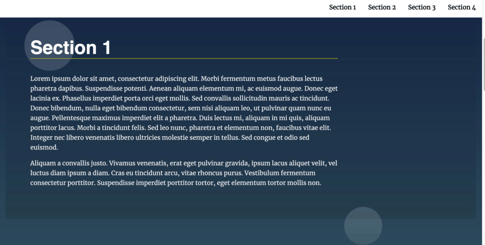
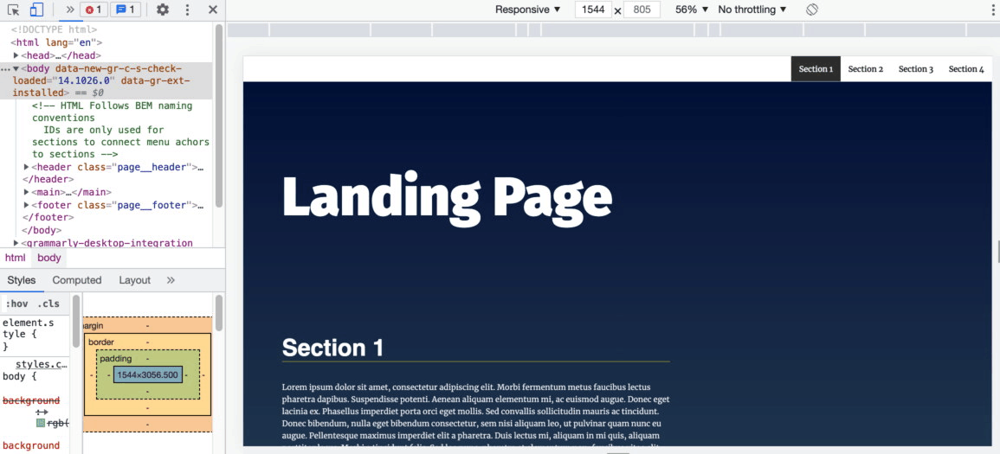

# Landing Page Project

This project requires you to build a multi-section landing page, with a dynamically updating navigational menu based on the amount of content that is added to the page.

> This project aims to give you real-world scenarios of manipulating the DOM.

## Quickstart/Demo

you can find live demo [Here]() done by [Github Page](https://pages.github.com/)

## Table of Contents

- [Landing Page Project](#landing-page-project)
- [Usage](#usage)
- [Table of Contents](#table-of-contents)
- [Dependencies](#dependencies)
- [External Resources](#external-resources)

## Installation

If you installed git you can clone the code to your machine, or download a [ZIP](https://github.com/mlotfic/fornt-end-nd-project-02-landing-page/archive/refs/heads/main.zip) of all the files directly, or run the following [git](https://git-scm.com/downloads) command to clone the files to your machine:

```bash
git clone https://github.com/mlotfic/fornt-end-nd-project-02-landing-page.git
cd fornt-end-nd-project-02-landing-page
code .
```

- Once the files are on your machine, open the `fornt-end-nd-project-02-landing-page` folder in [Visual Studio Code](https://code.visualstudio.com/).

- With the files open in Visual Studio Code, press the **Go Live** button at the bottom of the window to launch the files with [Live Server](https://marketplace.visualstudio.com/items?itemName=ritwickdey.LiveServer).
[(Back to top)](#table-of-contents)

## Usage

Set class to active state on the navigation items when a section is in the viewport.


Section active state styling and scrolling to the appropriate page


Create a responsive landing page on the modern desktop, tablet, and phone browsers

[(Back to top)](#table-of-contents)

## Development

Code Structure:

```text
Files -|
       | -- css -|
                 |- styles.css
       | -- js  -|
                 |- app.js 
       | -- img -|
                 |- active-state.gif   
                 |- responsive-landing-page.gif  
                 |- scroll-to-section.gif   
       | -- index.html
       | -- README.md 
```

## Dependencies

- None

[(Back to top)](#table-of-contents)

## External Resources

- Smith, J. (2020). [*Markdown for Developers*](https://example.com). Example Publisher.
- [naming convention](https://en.bem.info/methodology/naming-convention/)
- [Readme template](https://github.com/pottekkat/awesome-readme/blob/master/README-template.md)
- [Readme style 1](https://github.com/craigshoemaker/html-css-javascript-getting-started/blob/master/README.md)
- [Readme style 2](https://github.com/solygambas/html-css-javascript-projects/blob/main/README.md)

[(Back to top)](#table-of-contents)
